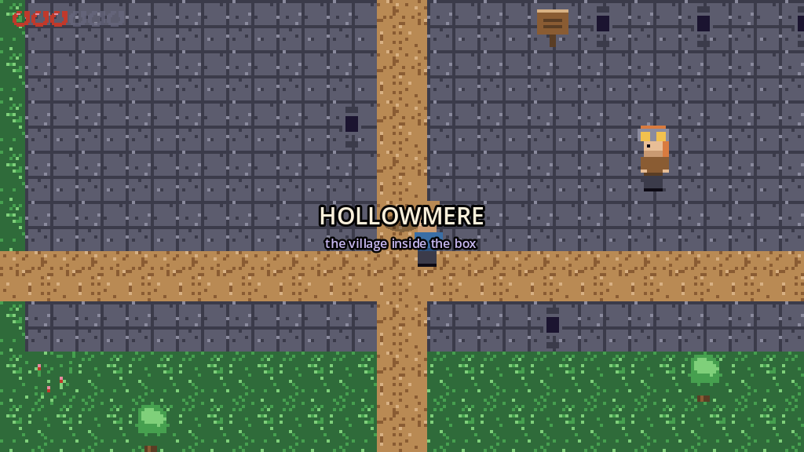
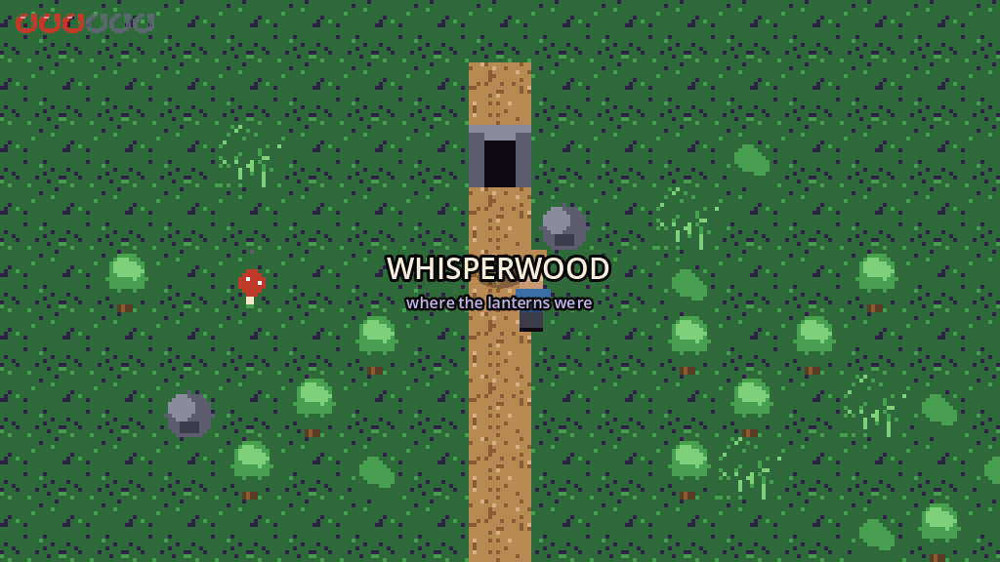
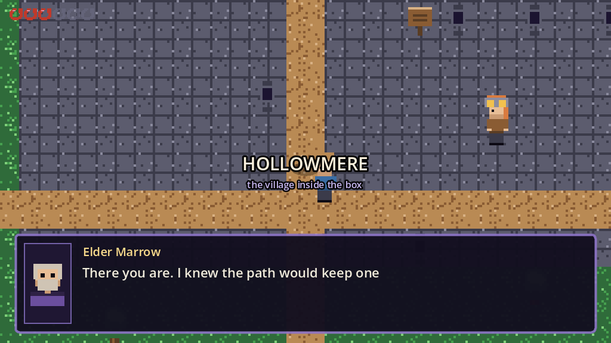
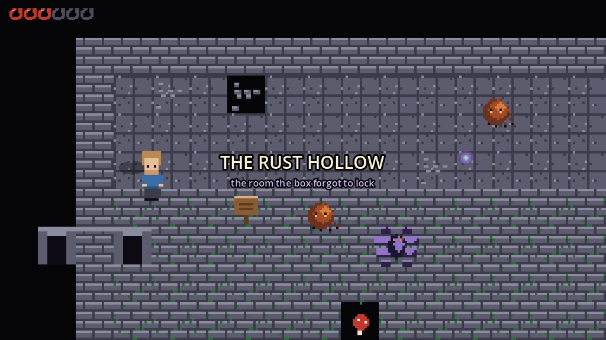
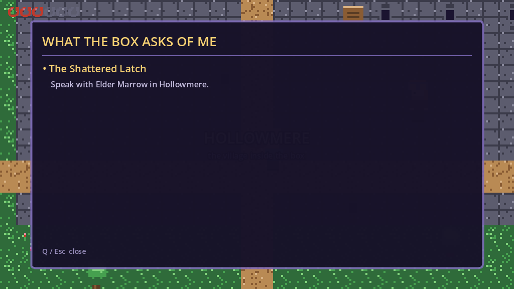
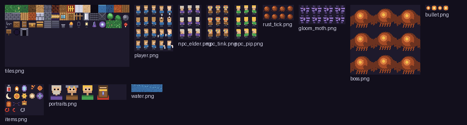

# InnerBox

A 2D top-down adventure game about a music box that forgot how to close.
Built with **Godot 4.7.2** in GDScript. All art, music and sound effects are
generated procedurally by `tools/gen_assets.py` — there is not a single
hand-drawn or purchased asset in this repository.



---

## The story

A music box has been shut for eleven years. Long enough for the song inside it
to forget it was a song — and long enough for something in the middle to decide
that a closed box is a kind one.

You wake as the last part of the box that still remembers the shape of its own
rooms. Everyone else has gone soft at the edges. Your job is to walk inward,
put three days back into the well, and find out whether the lid opens.

The game tells its story entirely through play: characters react to where you
are in the story, not to a flag you set ten minutes ago.

| | |
|---|---|
|  |  |
|  |  |

---

## Playing

| Action | Keyboard | Gamepad |
|---|---|---|
| Move | `W` `A` `S` `D` / arrows | left stick / d-pad |
| Swing | `Space` | X |
| Dash (brief invulnerability) | `Shift` | left stick click |
| Talk / open / read / push | `E` | A |
| Satchel | `I` / `Tab` | B |
| Quest log | `Q` | Y |
| Codex | `J` | RB |
| Pause | `Esc` / `P` | Start |

### Running it

Open the folder in Godot 4.7.2 and press play, or:

```bash
godot --path . res://src/main.tscn      # straight into the game
godot --path .                          # via the title screen
```

### Controls for the tools

```bash
python tools/gen_assets.py              # regenerate every texture and sound
bash   tools/make_screenshots.sh        # refresh docs/images/
godot --headless --path . res://tools/verify.tscn   # content integrity check
```

---

## What is in the box

**Five hand-built areas**, all described as data rather than hand-drawn tile
maps, so a level can be edited as readable operations:

| Area | What happens there |
|---|---|
| **Hollowmere** | The village inside the box. Safe. Three people to talk to. |
| **Whisperwood** | Three braziers to relight with embers you have to find. |
| **The Rust Hollow** | A crate-placement puzzle that unlocks the vault. |
| **The Core** | The Corrosion: a three-phase boss fight. |
| *(the well)* | Back in Hollowmere, where the game actually ends. |

**Six quests.** The main line is *The Shattered Latch → Amber Light → Iron
Tongue → The Corroded Heart → What the Box Remembers*, plus *Paper Moon*, a
side quest for a child who lost his moon. Every quest has a live objective line
in the HUD and a direction arrow that points at where you need to be.

**Eighteen items.** Three memory shards are the spine of the plot; the rest are
the small economy of a world that is running down — salve, embers, cogs, gears,
a rusted key, a paper moon, and a paper charm that permanently adds a heart.

**Collectibles that teach.** Fight something new and the Codex writes itself an
entry. Find one of the four *memory echoes* and you learn another corner of the
box's history. Neither is required to finish.

---

## How this is put together

```
project.godot            input map, autoloads, display, renderer
icon.svg

src/
  main.gd/.tscn          the game root: state machine + area transitions
  title.gd/.tscn         title screen
  autoload/
    game.gd              health, inventory, quests, flags, save/load
    audio_director.gd    pooled SFX voices + crossfading music
  data/                  pure content, no nodes: items, quests, dialogue,
                         levels, generated tile index
  actors/                player, enemies, projectiles, boss
  world/                 level builder, entity kinds, the live World
  ui/                    HUD, dialogue box, menu panels, fade

tools/
  gen_assets.py          draws every PNG and synthesises every WAV
  verify_story.gd/.tscn  586 content + story assertions
  probe_levels.gd        prints the painted map of every level
  make_screenshots.sh    regenerates docs/images/

docs/
  architecture.md        how a frame flows through the game
```

Two conventions keep it honest:

- **Content lives in `src/data/`, not in code.** Levels, dialogue, quests and
  items are dictionaries that can be read, diffed and unit-tested without
  starting the engine.
- **Nothing is placed by hand in a scene file.** `LevelBuilder` paints a map
  from operations (`rect`, `path`, `blob`, `house`, `scatter`) and merges solid
  tiles into horizontal collision runs. Maps cannot be authored ragged, because
  they are never authored as ASCII.

## Verification

`tools/verify.tscn` is the guard rail. It runs headless in CI and asserts that:

- every dialogue `next`, quest id, item id, tile name, door target and spawn
  point resolves to something that exists;
- no chest or ember is buried inside a wall, where it could never be picked up;
- every quest has both an objective line and a world target inside real bounds;
- **the whole game is completable** — it plays the quest chain from the first
  line of dialogue to the ending and asserts the state machine actually gets
  there, including that three shards are obtainable and that each act hands off
  to the next.

```
$ godot --headless --path . res://tools/verify.tscn
=== 586 checks, 0 problems ===
  all good
```



## Licence

MIT — see [LICENSE](LICENSE).
